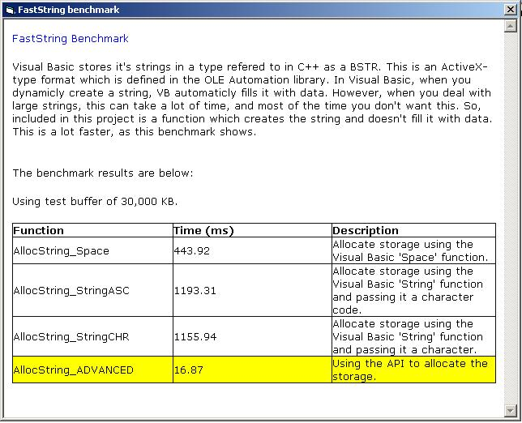



## Create string in VB more than 200 times faster\! See code\!

### Description

This article shows how to use the OLE Automation DLL to create a string without relying on VB to do it. When VB creates a string, it automaticly fills it with data (which takes a great deal of time when dealling with large strings). This way bypasses VB and creates the string itself, without filling it with data. The result? 200 times faster! I have updated the tutorial to include Example 1 re-written using the faster method. The code includes a benchmark and the function described below. Please vote or leave a comment!
 
### More Info
 

             |
---                |---
**Submitted On**   |2002-12-31 14:07:10
**By**             |[jbay101](https://github.com/Planet-Source-Code/PSCIndex/blob/master/ByAuthor/jbay101.md)
**Level**          |Advanced
**User Rating**    |4.9 (69 globes from 14 users)
**Compatibility**  |VB 5\.0, VB 6\.0
**Category**       |[Object Oriented Programming \(OOP\)](https://github.com/Planet-Source-Code/PSCIndex/blob/master/ByCategory/object-oriented-programming-oop__1-47.md)
**World**          |[Visual Basic](https://github.com/Planet-Source-Code/PSCIndex/blob/master/ByWorld/visual-basic.md)
**Archive File**   |[Create\_str15211912312002\.zip](https://github.com/Planet-Source-Code/jbay101-create-string-in-vb-more-than-200-times-faster-see-code__1-42042/archive/master.zip)

### Source Code

<html>
<head>
<meta http-equiv="Content-Language" content="en-us">
<meta name="GENERATOR" content="Microsoft FrontPage 5.0">
<meta name="ProgId" content="FrontPage.Editor.Document">
<meta http-equiv="Content-Type" content="text/html; charset=windows-1252">
<title>Visual Basic vs</title>
</head>
<body>

<b>Fast string in Visual Basic, version 2</b>

<b>Visual Basic vs. C++</b>

Visual Basic stores it's strings in a type
referred to in C++ as a BSTR. This type is completely different from the C char
type, as a BSTR doesn't necessarily terminate with a null, and it has a
different header. The C char is stored as an array of bytes, terminating at a
null byte or character 0x0. Unlike C or C++, when you create a string in VB it
is automatically filled with data. 

<b>The SLOW way&nbsp; - Visual Basic's String
creation 
</b>When you dynamically create a string in Visual Basic, there are only two
methods that VB supports. These are: 
1. Using the String function 
&nbsp;&nbsp;&nbsp; <u>Example: 
</u>&nbsp;&nbsp;&nbsp;
Dim strData As String&nbsp;&nbsp;&nbsp;
'our string variable 
&nbsp;&nbsp;&nbsp; Open &quot;test.bin&quot;
For Binary Access Read As #1&nbsp;&nbsp;&nbsp;
'open a file 
&nbsp;&nbsp;&nbsp; strData = String(LOF(1), 0)&nbsp;&nbsp;&nbsp;
'create a buffer 
&nbsp;&nbsp;&nbsp; Get #1, , strData&nbsp;&nbsp;&nbsp;
'read data into the buffer 
&nbsp;&nbsp;&nbsp; Close #1&nbsp;&nbsp;&nbsp;
'close the file 
&nbsp;&nbsp;&nbsp; The String function
takes two parameters, the length of the string and the character to fill the
string with.

2. Using the Space function 
&nbsp;&nbsp;&nbsp; This is much like using the String function, except it
automatically fills the string with spaces.

Now, for the example above all we want is an
empty storage space to fill with data. But VB doesn't do this. In both
instances, VB fills the string with data, which can take a lot of time. This is
where the API optimization comes into play.

&nbsp;

<b>The FAST way - the OLE Automation library 
</b>The OLE Automation library provides support, not only for the BSTR type but
also for all variable-related operations. To increase the speed of the string
creation, we want to tell the OLE Automation library to create a region of
memory that we can access - without filling it with data. To do this we will use
two functions, RtlMoveMemory in the windows kernel and SysAllocStringByteLen is
the OLE Automation library. The declarations are below.

Declare Sub
RtlMoveMemory Lib &quot;kernel32&quot; (dst
As Any, src As Any, 
ByVal nBytes&amp;) 
Declare Sub SysAllocStringByteLen&amp;
Lib &quot;oleaut32&quot; (ByVal
olestr&amp;, ByVal BLen&amp;)

The RltMoveMemory function copies nBytes bytes
from the src address to the dst address. The SysAllocStringByteLen allocates
BLen of storage space for a BSTR, or in this case a Visual Basic String. In
reality, the Visual Basic String is nothing more than a pointer, or a reference
to an address in memory that can be used to store the data. With this in mind,
we can create out own string allocation function, as shown below.

Public Function
AllocString(ByVal lSize As Long)
As String 
RtlMoveMemory ByVal VarPtr(AllocString_ADVANCED),
SysAllocStringByteLen(0&amp;, lSize + lSize), 4&amp; 
End Function 
 
This may look a bit complicated at first
but it is really relatively simple. The function allocates the space and then
copies the 4 byte pointer from this space to the string returned by the
function. If we were to expand the function a little it would look like this:

Public Function
AllocString(ByVal lSize As Long)
As String 
Dim lPtr As Long&nbsp;&nbsp;&nbsp;
'the address of the allocated memory 
Dim lRetPtr As Long&nbsp;&nbsp;&nbsp;
'the pointer to the return variable 
Dim sBuffer As String&nbsp;&nbsp;&nbsp;
'the variable to return 
lRetPtr = VarPtr(sBuffer)&nbsp;&nbsp;&nbsp;
'the pointer to the string buffer 
lPtr = SysAllocStringByteLen(0&amp;, lSize + lSize)&nbsp;&nbsp;&nbsp;
'allocate the memory and get it's pointer 
RtlMoveMemory ByVal lRetPtr, lPtr, 4&amp;&nbsp;&nbsp;&nbsp;
'copy the pointer address 
AllocString = sBuffer&nbsp;&nbsp;&nbsp; 'return the string
with the modified pointer 
End Function 
 
As someone highlighted in the previous
tutorial, when a value is returned it is duplicated and added to the stack. When
the function ends, this value is pushed off the stack and return to the assigned
variable. However, this is where some more knowledge of how VB works is
required. Visual Basic is not duplicating the data. All that Visual Basic is
doing is duplicating the pointer to the data. Why move 30 MB when you can move 4
bytes? Still, returning a value does take time, and if you a looking for a few
more miliseconds you could try making the call inline (removing the function all
together). For example, if your string is called strBuffer you could use the
code below.

Dim strBuffer
As String 
RtlMoveMemory ByVal VarPtr(strBuffer),
SysAllocStringByteLen(0&amp;, 100 + 100), 4&amp; '
allocate 100 bytes 
 
This method will be slightly faster, but I don't
think it's worth the trouble (unless you only need to allocate the data once)

As most of you know, when dealing with the
API it is very important to free all the memory you allocate, otherwise you can
easily develop memory leaks. But the best part of using the above method is that
we don't have to worry about freeing the memory block. When your Visual Basic
program ends (of a function/sub containing the relative variable ends), VB
automatically checks each variable and frees the memory associated with them. But
this is not a VB variable you may say? Wrong. This is a normal VB string
variable, we have just created it without VB. Any Visual Basic string function
will still work on the data. VB just doesn't know how it was allocated - but VB
doesn't care. If you really wanted, you could write a small function to delete a
string. Just be careful about how you do it. Since to create the variable we
just copied the pointer, some people may think that the below code would free
the string.

Public Function
DeallocString(sString As String) 
Dim lPtr As Long&nbsp;&nbsp;&nbsp;
'the address of the allocated memory 
lPtr = VarPtr(sBuffer)&nbsp;&nbsp;&nbsp;
'the pointer to the string buffer 
RtlMoveMemory ByVal lPtr, 0&amp;, 4&amp;&nbsp;&nbsp;&nbsp;
'copy the pointer address (nulls) 
End Function 
 
When dealing with other API types (and VB
types), erasing the pointer will tell VB or the API that the variable hasn't
been initialized. But VB will loose track of all the memory associated with the
string in this case. For the enclosed sample, that is 30 MB or RAM!!! The
correct way to remove the string is to use VB to do it. The easiest way is to
assign its value to &quot;&quot;. But if you really MUST write a function, you could tri
the one below.

Public Function
DeallocString(sString As String) 
sString = &quot;&quot; 
End Function

Sometimes the simplest way is the best!
 
 
Now that we know how to allocate strings
the fast way, we can re-write the sample in Example 1.

&nbsp;&nbsp;&nbsp;
Dim strData As String&nbsp;&nbsp;&nbsp;
'our string variable 
&nbsp;&nbsp;&nbsp; Open &quot;test.bin&quot;
For Binary Access Read As #1&nbsp;&nbsp;&nbsp;
'open a file 
&nbsp;&nbsp;&nbsp; strData = AllocString(LOF(1))&nbsp;&nbsp;&nbsp;
'create a buffer using out function 
&nbsp;&nbsp;&nbsp; Get #1, , strData&nbsp;&nbsp;&nbsp;
'read data into the buffer 
&nbsp;&nbsp;&nbsp; Close #1&nbsp;&nbsp;&nbsp;
'close the file 
 
It really is not that difficult, and it makes a HUGE speed increase. This
article comes with the above function and a benchmark to show the dramatic speed
difference.

The next tutorial will talk about making string functions (compare,
join etc) as fast as C and will show how to make a C string in Visual Basic.
Please leave a comment or vote!

</body>
</html>

